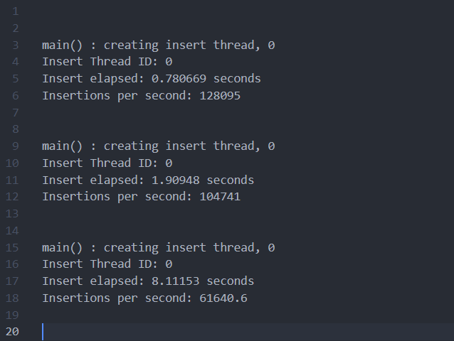

## 开发环境：

- 操作系统：Ubuntu 22.04.2 LTS on Windows 10 x86_64 
- 编译器：g++ (Ubuntu 11.4.0-1ubuntu1~22.04) 11.4.0
- 编辑器：vscode
- 语言服务器：Ubuntu clangd version 14.0.0-1ubuntu1.1
- 版本控制：git 
- 项目构建：cmake 3.22.1


## 基于跳表实现的轻量级键值型存储引擎

基于C++实现的采用跳表（skiplist）作为底层数据结构，支持插入、删除、查询、展示、数据落盘和文件加载。

引入智能指针，使用模板编程，确保了高效的查找和插入操作。


## 项目文件

- `main.cpp`    用调表进行数据操作
- `include`    跳表及其结点的实现
- `introduction`    项目讲解及备份等非项目必要内容
- `stress_test`    压力测试的cpp文件
- `CMakeLists.txt`    cmake配置文件
- `auto_build.sh`    自动运行cmake配置文件并在终端输出main.cpp内容
- `.gitignore`   忽视`git`不必要提交的文件

## 提供接口

- 插入结点

```cpp
    bool insert_element(const K& key, const V& value);
```

- 删除结点

```cpp
    bool delete_element(const K& key);
```

- 查询结点

```cpp
    bool search_element(const K& key);
```

- 展示跳表

```cpp
    void display_list();
```

- 数据存盘

```cpp
    void dump_file();
```

- 数据加载

```cpp
    void load_file();
```

- 数据大小

```cpp
    int size();
```


## 测试表现

调表树高：18

采用随机插入数据测试：

| 插入数据规模（万条） | 耗时（秒） | 每秒处理 |
| -------------------- | ---------- | -------- |
| 10                   | 0.78066    | 128095   |
| 20                   | 1.90948    | 104741   |
| 50                   | 8.11153    | 61640.6  |



## 待完善

- 文件导入的泛型支持
- 文档书写


[Skip List--跳表（全网最详细的跳表文章没有之一） - 简书 (jianshu.com)](https://www.jianshu.com/p/9d8296562806)

[mhvvv/SkipList: 基于跳表实现的轻量级键值型KV存储引擎，使用C++实现。 (github.com)](https://github.com/mhvvv/SkipList)

[youngyangyang04/Skiplist-CPP: A tiny KV storage based on skiplist written in C++ language| 使用C++开发，基于跳表实现的轻量级键值数据库🔥🔥 🚀 (github.com)](https://github.com/youngyangyang04/Skiplist-CPP)